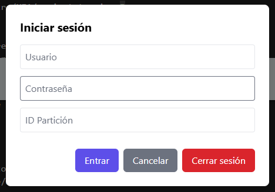
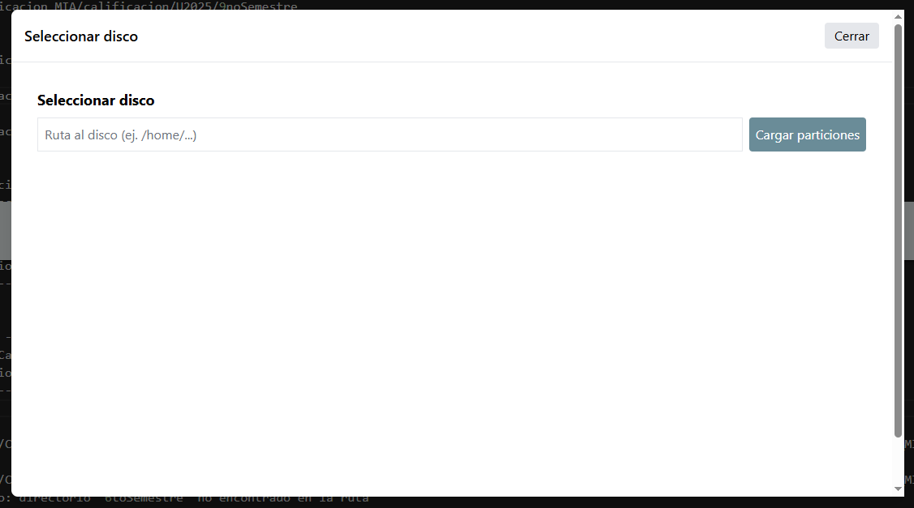
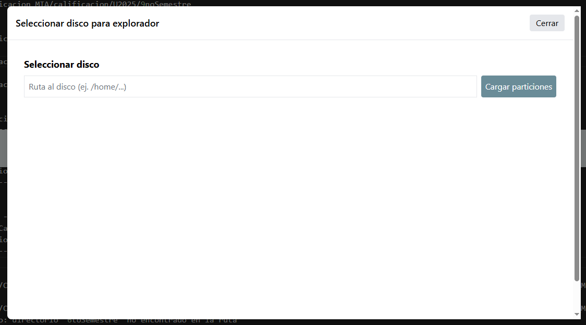
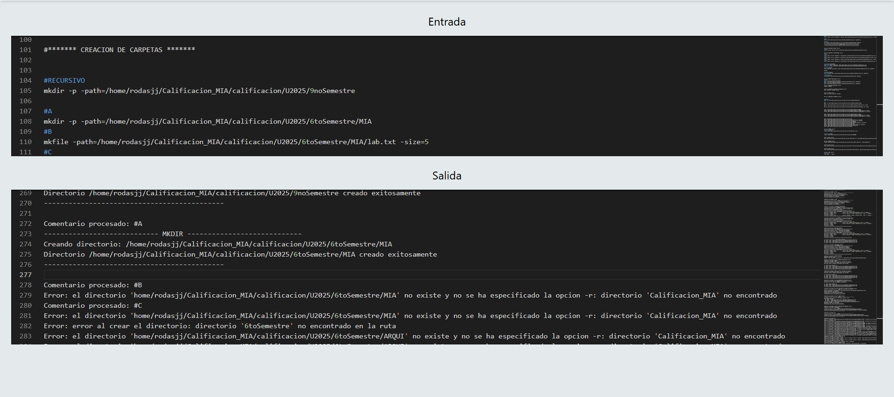

# Manual de Usuario – GoDisk 2.0  
Universidad de San Carlos de Guatemala  
Facultad de Ingeniería – Ingeniería en Ciencias y Sistemas  
Curso: Manejo e Implementación de Archivos  
Proyecto 2 – Segundo Semestre 2025  

---

## 1. Introducción  

El sistema **GoDisk 2.0** permite administrar, visualizar y manipular sistemas de archivos simulados en formato **EXT2/EXT3** desde una interfaz web.  
Este manual tiene como objetivo guiar al usuario en el uso general de la aplicación, describiendo las pantallas principales, los pasos de ejecución y ejemplos visuales.

---

## 2. Requisitos Previos  

| Requisito | Descripción |
|------------|-------------|
| Navegador Web | Se recomienda Google Chrome, Firefox o Edge actualizados. |
| Conexión a Internet | Acceso a AWS S3 (frontend) y EC2 (backend). |
| Archivo `.mia` | Archivo de disco generado desde el backend (Proyecto 1). |
| Usuario y Contraseña | Credenciales válidas de una partición existente. |

---

## 3. Pantalla Principal (Home)  

La pantalla principal presenta una **terminal de comandos** donde el usuario puede ejecutar todas las operaciones relacionadas con discos y particiones.

### Elementos principales  
- Campo de entrada de comandos  
- Área de salida con resultados y mensajes  
- Botón “Iniciar Sesión”  
- Botón para subir archivos `.mia`
---

## 4. Inicio de Sesión  

El sistema permite autenticarse mediante un formulario gráfico.  
Debe ingresarse la partición, usuario y contraseña previamente creados.

### Pasos  
1. Clic en “Iniciar Sesión”  
2. Completar los campos del formulario  
3. Presionar “Entrar” para iniciar sesión  

### Espacio para imagen de inicio de sesión  
```

```

---

## 5. Selección de Disco  

Una vez autenticado, se mostrará la lista de **discos montados (.mia)** disponibles.  

Cada tarjeta de disco mostrará:  
- Nombre del disco  
- Capacidad total  
- Tipo de ajuste (Fit)  
- Número de particiones montadas  

### Espacio para imagen de selección de disco  
```

```

---

## 6. Selección de Partición  

Tras seleccionar un disco, se muestran las **particiones** que contiene.  

Cada partición detalla:  
- Tamaño en MB  
- Tipo de Fit  
- Estado (activa o desmontada)  

### Espacio para imagen de selección de partición  
```

```

---

## 7. Visualizador del Sistema de Archivos  

Permite navegar el sistema de archivos simulado.  
Muestra carpetas, archivos y permisos asociados (modo lectura).

### Funciones principales  
- Ingresar a carpetas internas  
- Ver información del archivo (nombre, permisos, propietario)  
- Visualizar contenido de archivos `.txt`

### Espacio para imagen del explorador de archivos  
```

```

---

## 8. Visualizador de Archivos de Texto  

Muestra el contenido del archivo seleccionado en modo lectura.  
El archivo se abre en un área de texto de solo lectura.


---

## 9. Terminal de Comandos  

El área de comandos permite ejecutar directamente las instrucciones soportadas por el sistema.

### Ejemplos  

| Comando | Descripción |
|----------|--------------|
| `mkdisk -size=1024 -path=/home/disco1.dk` | Crea un nuevo disco virtual. |
| `fdisk -add=500 -name=part1 -path=/home/disco1.dk` | Agrega espacio a una partición. |
| `mount -path=/home/disco1.dk -name=part1` | Monta una partición. |
| `mkfs -id=061A -fs=3fs` | Formatea en EXT3. |
| `login -user=root -pass=123 -id=061A` | Inicia sesión en la partición. |
| `mkdir -path=/home/docs` | Crea un directorio. |

### Espacio para imagen de la terminal con comandos  
```

```

---

## 10. Journal (Bitácora de Cambios)  

El sistema registra todas las operaciones en el **Journal**, incluyendo:  
- Comando ejecutado  
- Ruta afectada  
- Fecha y hora  
- Usuario responsable  

---

## 11. Recuperación del Sistema  

En caso de error o pérdida de datos, se pueden usar los siguientes comandos:

| Comando | Función |
|----------|---------|
| `loss -id=061Disco1` | Simula pérdida de datos. |
| `recovery -id=061Disco1` | Restaura el sistema desde el journaling. |


---

## 12. Cierre de Sesión  

Desde la pantalla principal, el usuario puede cerrar sesión con el botón **“Cerrar Sesión”**.

Esto:  
- Invalida la sesión activa  
- Limpia el contexto de usuario  
- Desactiva comandos que requieren autenticación  

---

## 13. Despliegue en AWS  

El sistema se encuentra hospedado en **AWS**:  
- **Frontend (S3):** contiene la interfaz web.  
- **Backend (EC2):** ejecuta la API REST en Go.  


---

## 14. Solución de Problemas Comunes  

| Problema | Posible Causa | Solución |
|-----------|----------------|-----------|
| No se conecta al backend | API no desplegada o error de CORS | Revisar EC2 y configuración de CORS. |
| Error al iniciar sesión | Usuario o partición inválida | Verificar credenciales y nombre de partición. |
| No se muestra el archivo | Permisos insuficientes o ruta incorrecta | Validar permisos con `chmod` o `chown`. |
| No carga el frontend | Bucket S3 sin permisos públicos | Configurar política del bucket en AWS. |

---

## 15. Créditos  

- **Autor:** Juan José Rodas Mansilla
- **Carné:** 202200389  
- **Curso:** Manejo e Implementación de Archivos  
- **Año:** 2025 – Segundo Semestre  
